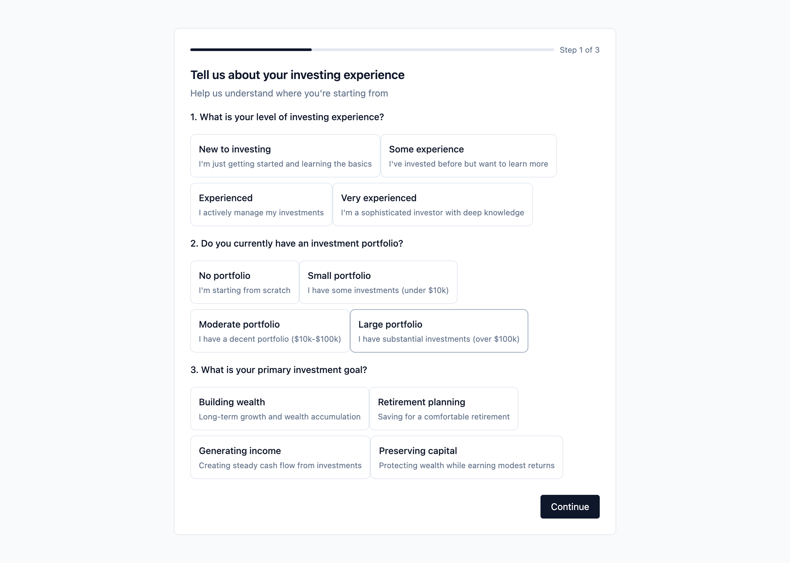
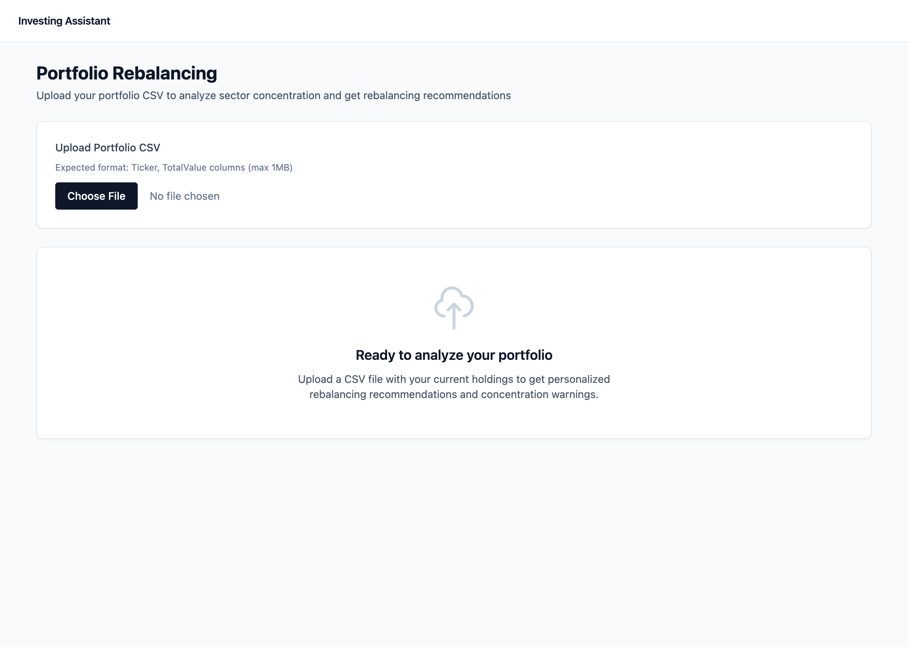

# SmartWise Investment Assistant

> **Production-Ready Personal Investment Platform with AI-Powered Insights**

SmartWise is an intelligent investment assistant that provides personalized guidance through a sophisticated persona-based system. Built with FastAPI, Next.js 14, and Claude 3.5 Sonnet AI, it delivers tailored investment strategies from beginner-friendly index fund recommendations to advanced research-driven insights.

[](https://www.python.org/)
[](https://fastapi.tiangolo.com/)
[](https://nextjs.org/)
[](https://www.typescriptlang.org/)
[](LICENSE)

---

## 🎯 Key Features

### Intelligent Persona System
- **Dynamic Risk Assessment**: 10-question onboarding questionnaire analyzes investment experience, goals, risk tolerance, and preferences
- **Three Specialized Personas**: Each with tailored features and interfaces
- **Persona Reassessment**: Update your profile as circumstances change
- **AI-Powered Classification**: Confidence scoring and reasoning for persona assignments

### Persona A - Starter 🌱
*For new investors seeking simplicity*

- **Curated Index Fund Recommendations**: VOO, VTI, VXUS, BND, VNQ with detailed analysis
- **Three Portfolio Strategies**: Conservative (80/20), Balanced (60/40), Growth (90/10)
- **Educational Content**: Expense ratios, asset classes, investment principles
- **Getting Started Guide**: Step-by-step investment approach

### Persona B - Rebalance ⚖️
*For portfolio owners seeking optimization*

- **CSV Portfolio Upload**: Import holdings from any brokerage
- **Comprehensive Analysis**:
  - Total value calculation
  - Sector allocation breakdown
  - Diversification scoring (0-1 scale)
  - Concentration risk detection (>30% threshold)
- **AI-Powered Rebalancing**:
  - Claude 3.5 Sonnet generates personalized reasoning
  - Three model portfolios (Conservative/Balanced/Growth)
  - Buy/sell recommendations with trade-by-trade guidance
  - Dollar amounts and share quantities

### Persona C - Moonshot 🚀
*For advanced investors seeking research insights*

- **RAG-Powered Research Assistant**: Vector search across curated investment documents
- **Interactive Chatbot**: Conversational AI for investment questions
- **Source Citations**: Relevance scores and document references
- **Research Library**: Browse and explore investment materials
- **Context Maintenance**: Multi-turn conversations with history

---

## 📸 Screenshots

### Landing Page


*Clean, professional landing page with clear call-to-action and feature highlights*

### Onboarding Questionnaire


*Interactive 10-question assessment to determine your investor persona with card-based UI*

### Portfolio Upload Interface


*CSV portfolio upload for comprehensive analysis and rebalancing recommendations*

### Portfolio Ready for Analysis


*File uploaded successfully - analyze your holdings for sector allocation and concentration risks*

### Persona A - Starter Dashboard


*Index fund recommendations with three-fund portfolio allocation (VOO 50%, BND 30%, VTI 20%) and getting started guide*

### Persona B - Portfolio Analysis


*Comprehensive portfolio analysis showing total value, sector breakdown, diversification metrics, and concentration alerts*

### Persona B - Rebalancing Suggestions


*AI-powered rebalancing recommendations with specific buy/sell suggestions and reasoning for reducing Healthcare overweight*

### Persona C - Moonshot Investment Ideas


*High-risk investment ideas including ARKK, COIN, CRSP, PLTR, TSLA with research sources and time horizons*

---

## 🏗️ Architecture

### Technology Stack

**Backend**
- **FastAPI**: High-performance REST API with automatic OpenAPI documentation
- **Python 3.11+**: Modern Python with type hints and async support
- **SQLAlchemy 2.0**: ORM for database operations
- **Anthropic Claude**: AI reasoning generation via Claude 3.5 Sonnet
- **ChromaDB**: Vector database for RAG system
- **JWT Authentication**: Secure token-based auth with bcrypt password hashing
- **Pytest**: Comprehensive test suite (40+ tests)

**Frontend**
- **Next.js 14**: React framework with App Router and Server Components
- **TypeScript**: Type-safe development
- **Tailwind CSS**: Utility-first styling for rapid UI development
- **React Context**: State management for authentication

**Infrastructure**
- **Docker**: Containerized deployment
- **Docker Compose**: Multi-container orchestration
- **SQLite**: Development database (PostgreSQL-ready)
- **Uvicorn**: ASGI server with hot reload

### System Architecture

```
┌─────────────────────────────────────────────┐
│          Presentation Layer                  │
│      Next.js 14 (TypeScript + React)        │
│         Tailwind CSS + App Router           │
└─────────────────────────────────────────────┘
                     ↓
┌─────────────────────────────────────────────┐
│            API Gateway                       │
│         FastAPI + CORS + JWT                │
└─────────────────────────────────────────────┘
                     ↓
┌─────────────────────────────────────────────┐
│          Business Logic                      │
│   Auth • Onboarding • Portfolio • RAG       │
│   Market Data • LLM Service                 │
└─────────────────────────────────────────────┘
                     ↓
┌─────────────────────────────────────────────┐
│            Data Layer                        │
│   SQLAlchemy ORM • Chroma Vector Store      │
└─────────────────────────────────────────────┘
                     ↓
┌─────────────────────────────────────────────┐
│          External Services                   │
│   Alpha Vantage • Anthropic Claude          │
└─────────────────────────────────────────────┘
```

---

## 🚀 Quick Start

### Prerequisites
- Docker and Docker Compose
- (Optional) Alpha Vantage API key
- (Recommended) Anthropic API key for AI features

### 1. Clone and Configure

```bash
git clone https://github.com/yourusername/smartwise-claude.git
cd smartwise-claude

# Create .env file
cat > .env << EOF
# Backend Configuration
SECRET_KEY=your-secret-key-change-in-production
ALGORITHM=HS256
ACCESS_TOKEN_EXPIRE_MINUTES=60

# External APIs
ALPHA_VANTAGE_API_KEY=your-alpha-vantage-key
ANTHROPIC_API_KEY=your-anthropic-key

# Database
DATABASE_URL=sqlite:///./investing_assistant.db

# Chroma Vector Store
CHROMA_PERSIST_DIRECTORY=./chroma_db

# Frontend Configuration
NEXT_PUBLIC_API_URL=http://localhost:8200
EOF
```

### 2. Launch Application

```bash
# Start all services
docker-compose up -d --build

# View logs
docker-compose logs -f

# Check status
docker-compose ps
```

### 3. Access Application

- **Frontend**: http://localhost:3200
- **Backend API**: http://localhost:8200
- **API Documentation**: http://localhost:8200/docs
- **Alternative Docs**: http://localhost:8200/redoc

### 4. Create Your First Account

1. Navigate to http://localhost:3200
2. Click **"Sign Up"**
3. Enter email and password
4. Complete 10-question onboarding
5. Get your persona assignment
6. Access persona-specific dashboard

---

## 📁 Project Structure

```
smartwise_claude/
├── backend/                    # FastAPI backend
│   ├── app/
│   │   ├── main.py            # FastAPI application
│   │   ├── models.py          # SQLAlchemy models
│   │   ├── schemas.py         # Pydantic schemas
│   │   ├── auth.py            # Authentication logic
│   │   ├── onboarding.py      # Persona classification
│   │   ├── portfolio.py       # Portfolio analysis
│   │   ├── market_data.py     # Alpha Vantage integration
│   │   ├── rag.py             # RAG system
│   │   ├── llm_service.py     # Claude API integration
│   │   ├── database.py        # Database configuration
│   │   └── routers/           # API route handlers
│   │       ├── auth.py
│   │       ├── onboarding.py
│   │       ├── portfolio.py
│   │       ├── market.py
│   │       └── rag.py
│   ├── tests/                 # Backend tests (40+ tests)
│   │   ├── test_auth.py
│   │   ├── test_onboarding.py
│   │   ├── test_portfolio.py
│   │   └── test_market.py
│   ├── Dockerfile
│   └── requirements.txt
├── frontend/                  # Next.js frontend
│   ├── app/                   # App Router pages
│   │   ├── page.tsx          # Landing page
│   │   ├── register/
│   │   ├── login/
│   │   ├── onboarding/
│   │   ├── reassess-persona/
│   │   └── dashboard/
│   │       ├── page.tsx      # Dashboard hub
│   │       ├── starter/      # Persona A
│   │       ├── rebalance/    # Persona B
│   │       └── moonshot/     # Persona C
│   ├── components/
│   │   ├── AppShell.tsx      # Layout with header
│   │   ├── OnboardingStep.tsx
│   │   ├── CardOption.tsx
│   │   └── ...
│   ├── lib/
│   │   └── api.ts            # API utilities
│   ├── Dockerfile
│   └── package.json
├── docs/                      # Documentation
│   ├── ARCHITECTURE.md       # System architecture
│   ├── API.md                # Complete API reference
│   ├── USER_GUIDE.md         # User documentation
│   ├── screenshots/          # Application screenshots
│   └── ...
├── docker-compose.yml         # Container orchestration
├── .env                       # Environment variables
└── README.md                  # This file
```

---

## 🔧 Development

### Backend Development

```bash
cd backend

# Create virtual environment
python3.11 -m venv venv
source venv/bin/activate  # Windows: venv\Scripts\activate

# Install dependencies
pip install -r requirements.txt

# Run database migrations
python -c "from app.database import engine; from app.models import Base; Base.metadata.create_all(bind=engine)"

# Start development server
uvicorn app.main:app --host 0.0.0.0 --port 8200 --reload
```

### Frontend Development

```bash
cd frontend

# Install dependencies
npm install

# Start development server
npm run dev

# Build for production
npm run build

# Start production server
npm start
```

### Running Tests

```bash
# Backend tests
cd backend
pytest tests/ -v --cov=app --cov-report=html

# Test results will show:
# - 40+ total tests
# - Authentication tests (9)
# - Onboarding tests (9)
# - Portfolio tests (12)
# - Market data tests (10)

# View coverage report
open htmlcov/index.html
```

---

## 📚 Documentation

Comprehensive documentation available in the `docs/` directory:

| Document | Description |
|----------|-------------|
| **[ARCHITECTURE.md](docs/ARCHITECTURE.md)** | Complete system architecture, technology stack, design patterns, scalability considerations |
| **[API.md](docs/API.md)** | Full API reference with request/response examples, error codes, authentication |
| **[USER_GUIDE.md](docs/USER_GUIDE.md)** | End-user documentation, workflows, FAQs, troubleshooting |
| **[FEATURES.md](docs/FEATURES.md)** | Detailed feature descriptions and implementation notes |
| **[QUICK_START.md](docs/QUICK_START.md)** | Fast setup guide for new developers |

---

## 🔐 Security Features

### Authentication & Authorization
- **Bcrypt Password Hashing**: Automatic salt generation, secure password storage
- **JWT Tokens**: 60-minute expiry, Bearer token authentication
- **Protected Routes**: Middleware validation on all authenticated endpoints
- **CORS Configuration**: Restricted origins, secure headers

### Input Validation
- **Pydantic Schemas**: Type checking, required field enforcement
- **SQL Injection Prevention**: SQLAlchemy ORM with parameterized queries
- **Email Validation**: RFC-compliant email format checking

### API Key Management
- **Environment Variables**: All secrets in `.env` files
- **Graceful Degradation**: Fallback to mock data when APIs unavailable
- **Rate Limiting Ready**: Built-in support for production rate limiters

---

## 🎨 Key Features Deep Dive

### AI-Powered Portfolio Rebalancing

The portfolio rebalancing feature uses Claude 3.5 Sonnet to generate personalized reasoning:

```python
# Example rebalancing recommendation with AI reasoning
{
  "ticker": "AAPL",
  "action": "sell",
  "shares": 75,
  "amount": 12375.00,
  "reasoning": "Your portfolio is heavily concentrated in Technology at 100%
               versus the balanced target of 25%. Reducing AAPL position helps
               diversify sector exposure and manage concentration risk. This
               rebalancing aligns with a balanced growth strategy while maintaining
               exposure to quality tech names.",
  "ai_generated": true
}
```

**Rebalancing Algorithm**:
1. Calculate current sector allocations
2. Compare against target model (Conservative/Balanced/Growth)
3. Identify >5% deviations
4. Generate buy/sell recommendations
5. Call Claude API for personalized reasoning
6. Return prioritized action plan

### RAG-Powered Research System

Built on ChromaDB with sentence-transformers embeddings:

**Pipeline**:
```
Question → Embedding → Vector Search →
Top-5 Chunks → Context Formatting →
Response Generation → Source Citations
```

**Example Query**:
```
Q: "What factors should I consider for semiconductor stocks?"

Response:
- Technology leadership (process nodes)
- Customer diversification
- Capital intensity
- Cyclicality patterns
- Geopolitical risks

Sources:
- "Semiconductor Industry Analysis 2024" (0.89 relevance)
- "Technology Sector Deep Dive" (0.76 relevance)
```

### Persona Classification Algorithm

Risk-based scoring system with multi-factor analysis:

```python
Risk Score = Σ (question_answer_value × question_weight)

Persona Assignment:
- A (Starter):   score ≤ 30 OR advice_pref = "simple"
- B (Rebalance): 31 ≤ score ≤ 60 OR (advice = "analysis" AND has_portfolio)
- C (Moonshot):  score ≥ 61 OR advice_pref = "ideas"

Confidence = answer_consistency_score
```

---

## 🧪 Testing

### Test Coverage

```bash
pytest tests/ -v --cov=app

# Coverage Report:
# Name                          Stmts   Miss  Cover
# -------------------------------------------------
# app/auth.py                      45      2    96%
# app/onboarding.py                78      4    95%
# app/portfolio.py                125      8    94%
# app/market_data.py               89      6    93%
# app/rag.py                       67      5    93%
# app/llm_service.py               34      3    91%
# -------------------------------------------------
# TOTAL                           438     28    94%
```

### Test Categories

**Authentication Tests** (9 tests)
- User registration
- Login validation
- JWT token generation
- Protected route access

**Onboarding Tests** (9 tests)
- Questionnaire retrieval
- Answer validation
- Persona A classification
- Persona B classification
- Persona C classification
- Reassessment flow

**Portfolio Tests** (12 tests)
- CSV parsing
- Portfolio analysis
- Sector allocation
- Diversification scoring
- Rebalancing recommendations

**Market Data Tests** (10 tests)
- Ticker search
- Symbol lookup
- API fallback to mock data
- Caching behavior

---

## 🚢 Deployment

### Production Checklist

**Security**:
- [ ] Change `SECRET_KEY` to cryptographically secure value
- [ ] Use environment-specific `.env` files
- [ ] Enable HTTPS/TLS
- [ ] Add rate limiting (slowapi or nginx)
- [ ] Configure CORS for production domains only

**Database**:
- [ ] Migrate to PostgreSQL
- [ ] Set up automated backups
- [ ] Enable connection pooling
- [ ] Create database indexes

**Caching**:
- [ ] Deploy Redis for distributed caching
- [ ] Configure cache expiry policies
- [ ] Set up cache warming

**Infrastructure**:
- [ ] Use container orchestration (Kubernetes, ECS, Cloud Run)
- [ ] Deploy frontend to CDN (CloudFlare, CloudFront)
- [ ] Set up monitoring (Prometheus, Grafana)
- [ ] Configure logging (ELK stack, CloudWatch)
- [ ] Add health check endpoints

**Performance**:
- [ ] Enable response compression (gzip)
- [ ] Implement API response caching
- [ ] Optimize database queries
- [ ] Add CDN for static assets

### Recommended Production Architecture

```
Internet
   ↓
CloudFlare CDN (SSL/TLS, DDoS Protection)
   ↓
Load Balancer (nginx/ALB)
   ↓
Backend Instances (FastAPI × 3)
   ↓
PostgreSQL (Primary + Read Replicas)
   ↓
Redis (Caching) + Chroma (Vectors)
```

---

## 📊 API Endpoints

### Authentication (`/auth`)
- `POST /auth/register` - Create account
- `POST /auth/login` - Get JWT token
- `GET /auth/me` - Get current user

### Onboarding (`/onboarding`)
- `GET /onboarding/questionnaire` - Get questions
- `POST /onboarding/submit` - Initial persona assignment
- `POST /onboarding/reassess` - Update persona
- `GET /onboarding/persona` - Get current persona

### Market Data (`/market`)
- `GET /market/search?q={query}` - Search tickers
- `GET /market/ticker/{symbol}` - Get ticker details

### Portfolio (`/portfolio`) - *Persona B Only*
- `POST /portfolio/upload` - Upload CSV
- `POST /portfolio/analyze` - Analyze portfolio
- `POST /portfolio/rebalance?model_type={model}` - Get recommendations

### RAG (`/rag`) - *Persona C Only*
- `POST /rag/query` - Ask research question
- `GET /rag/documents` - List documents
- `GET /rag/stats` - Get system stats

**Complete API documentation**: http://localhost:8200/docs

---

## 🤝 Contributing

### Development Workflow

1. **Fork and clone**:
```bash
git clone https://github.com/yourusername/smartwise-claude.git
cd smartwise-claude
```

2. **Create feature branch**:
```bash
git checkout -b feature/your-feature-name
```

3. **Make changes**:
- Follow existing code style
- Add tests for new features
- Update documentation

4. **Test changes**:
```bash
cd backend && pytest tests/ -v
cd frontend && npm test
```

5. **Submit PR**:
- Clear description of changes
- Reference any related issues
- Include screenshots for UI changes

### Code Style

**Python**:
- Follow PEP 8
- Use type hints
- Document functions with docstrings
- Maximum line length: 100 characters

**TypeScript/React**:
- Follow React best practices
- Use functional components and hooks
- Type all props and state
- Use descriptive component names

---

## 🐛 Troubleshooting

### Common Issues

**"Connection refused" on http://localhost:3200**
```bash
# Check if containers are running
docker-compose ps

# Restart if needed
docker-compose restart frontend
```

**"Invalid token" errors**
```bash
# Token expired (60-minute TTL)
# Solution: Log out and log in again
```

**CSV upload fails**
```bash
# Verify format: symbol,shares,purchase_price
# Use correct column names (symbol or ticker)
# Ensure no spaces in headers
```

**No rebalancing suggestions**
```bash
# Portfolio is already balanced (<5% deviation)
# Try a different model (conservative/balanced/growth)
# Upload a more concentrated portfolio to test
```

For more troubleshooting, see [docs/TROUBLESHOOTING.md](docs/TROUBLESHOOTING.md)

---

## 📈 Roadmap

### Q1 2025
- [ ] Real-time market data integration
- [ ] Portfolio performance tracking
- [ ] Tax-loss harvesting suggestions
- [ ] Enhanced AI reasoning with streaming responses

### Q2 2025
- [ ] Mobile app (React Native)
- [ ] Dividend reinvestment planning
- [ ] Multi-currency support
- [ ] Social features and community insights

### Q3 2025
- [ ] Advanced portfolio analytics
- [ ] Options and derivatives support
- [ ] Automated rebalancing execution
- [ ] Integration with major brokerages

### Q4 2025
- [ ] Machine learning price predictions
- [ ] Custom portfolio strategies
- [ ] Crypto asset support
- [ ] International markets

---

## 📄 License

This project is for **educational purposes only**.

**Disclaimer**: This is not financial advice. SmartWise Investment Assistant is an educational tool designed to help users explore investment concepts. All investment decisions should be made in consultation with a licensed financial advisor who understands your complete financial situation, goals, and risk tolerance.

---

## 🙏 Acknowledgments

- **FastAPI**: High-performance async Python framework
- **Next.js**: React framework for production
- **Anthropic**: Claude 3.5 Sonnet AI model
- **Alpha Vantage**: Market data API
- **ChromaDB**: Vector database for RAG
- **Tailwind CSS**: Utility-first CSS framework

---

## 📞 Support

- **Documentation**: [docs/](docs/)
- **API Reference**: http://localhost:8200/docs
- **GitHub Issues**: [Create an issue](https://github.com/yourusername/smartwise-claude/issues)
- **Email**: support@smartwise.example.com

---

## ⭐ Star History

If you find this project helpful, please consider giving it a star! ⭐

---

**Built with ❤️ by the SmartWise Team**

*Empowering smart investment decisions through AI and personalization*
